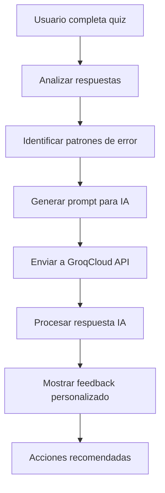

# Propuesta: Retroalimentación IA Personalizada

## Problema Identificado
Study Helper actualmente solo muestra estadísticas básicas en la pantalla de resultados, sin generar retroalimentación personalizada basada en el análisis de las fallas y aciertos específicos del usuario.

## Solución Propuesta

### 1. Análisis de Respuestas
```javascript
// En App.jsx - Después de terminar el quiz
const generatePersonalizedFeedback = async (questions, userAnswers, topic, difficulty) => {
  const incorrectAnswers = userAnswers.filter(a => !a.correct);
  const correctAnswers = userAnswers.filter(a => a.correct);
  
  // Identificar patrones de error
  const errorPatterns = analyzeErrorPatterns(questions, incorrectAnswers);
  
  // Generar prompt para IA
  const feedbackPrompt = `
    Analiza el rendimiento de un estudiante en un quiz sobre "${topic}" (dificultad: ${difficulty}).
    
    Resultados:
    - Correctas: ${correctAnswers.length}/${questions.length}
    - Incorrectas: ${incorrectAnswers.length}
    
    Errores específicos:
    ${errorPatterns.map(pattern => `- ${pattern}`).join('\n')}
    
    Genera retroalimentación personalizada que incluya:
    1. Fortalezas detectadas
    2. Áreas de mejora específicas
    3. Sugerencias de estudio personalizadas
    4. Recomendaciones para el próximo intento
    
    Formato: JSON con estructura clara y motivacional.
  `;
  
  // Llamar a API de Groq
  const feedback = await callGroqAPI(feedbackPrompt);
  return feedback;
};
```

### 2. Componente de Feedback Mejorado
```javascript
// ResultsScreen.jsx - Versión mejorada
const ResultsScreen = ({ 
  score, 
  correctAnswers, 
  totalQuestions, 
  topic, 
  difficulty,
  earnedPoints,
  totalPoints, 
  onRestart,
  personalizedFeedback,
  isLoadingFeedback
}) => {
  return (
    <div className="duo-container">
      {/* Estadísticas básicas */}
      <div className="duo-results-stats">
        {/* ... código existente ... */}
      </div>
      
      {/* Sección de Retroalimentación IA */}
      {isLoadingFeedback ? (
        <div className="feedback-loading">
          <div className="loading-spinner" />
          <p>Generando retroalimentación personalizada...</p>
        </div>
      ) : personalizedFeedback ? (
        <div className="ai-feedback-section">
          <h3>🤖 Análisis Personalizado</h3>
          
          <div className="feedback-strengths">
            <h4>🎯 Fortalezas Detectadas</h4>
            <ul>
              {personalizedFeedback.strengths.map((strength, index) => (
                <li key={index}>{strength}</li>
              ))}
            </ul>
          </div>
          
          <div className="feedback-improvements">
            <h4>📚 Áreas de Mejora</h4>
            <ul>
              {personalizedFeedback.improvements.map((improvement, index) => (
                <li key={index}>{improvement}</li>
              ))}
            </ul>
          </div>
          
          <div className="feedback-recommendations">
            <h4>💡 Sugerencias de Estudio</h4>
            <div className="recommendations-grid">
              {personalizedFeedback.recommendations.map((rec, index) => (
                <div key={index} className="recommendation-card">
                  <h5>{rec.title}</h5>
                  <p>{rec.description}</p>
                  <div className="recommendation-actions">
                    <button className="btn btn-sm">Practicar esto</button>
                    <button className="btn btn-sm btn-outline">Ver guía</button>
                  </div>
                </div>
              ))}
            </div>
          </div>
          
          <div className="feedback-motivation">
            <div className="motivation-quote">
              <Quote size={20} />
              <p>{personalizedFeedback.motivation}</p>
            </div>
          </div>
        </div>
      ) : null}
      
      <button onClick={onRestart} className="duo-btn duo-btn-success">
        Nuevo Quiz
      </button>
    </div>
  );
};
```

### 3. Análisis de Patrones de Error
```javascript
// utils/errorAnalysis.js
export const analyzeErrorPatterns = (questions, incorrectAnswers) => {
  const patterns = [];
  
  incorrectAnswers.forEach(incorrect => {
    const question = questions[incorrect.questionIndex];
    
    // Analizar tipo de pregunta
    if (question.question.includes('¿Qué es')) {
      patterns.push('Dificultad en preguntas de definición');
    }
    
    if (question.question.includes('¿Cuál es')) {
      patterns.push('Problemas con preguntas de identificación');
    }
    
    // Analizar opciones incorrectas seleccionadas
    const wrongOption = question.options[incorrect.answer];
    if (wrongOption.includes('siempre') || wrongOption.includes('nunca')) {
      patterns.push('Tendencia a generalizaciones absolutas');
    }
    
    // Analizar temas específicos
    if (question.question.includes('matemáticas')) {
      patterns.push('Necesita reforzar conceptos matemáticos');
    }
  });
  
  // Eliminar duplicados y priorizar
  return [...new Set(patterns)];
};
```

### 4. Flujo de Implementación


### 5. Mejoras en la Experiencia de Usuario

#### **Feedback Inmediato:**
- Loading state mientras se genera feedback
- Animaciones suaves al aparecer resultados
- Progress indicator para el análisis

#### **Interactividad:**
- Botones de acción directa desde el feedback
- Links a guías de estudio relevantes
- Opción de descargar reporte personalizado

#### **Gamificación:**
- Badges por superar áreas débiles
- Streaks por mejora continua
- Logros basados en patrones de progreso

### 6. Consideraciones Técnicas

#### **Performance:**
- Cache de feedbacks similares
- Timeout handling para API calls
- Fallback a feedback genérico si falla IA

#### **Costos API:**
- Optimización de prompts para reducir tokens
- Batch processing para múltiples usuarios
- Rate limiting para evitar sobrecostos

#### **Escalabilidad:**
- Queue system para generación de feedback
- Background processing para análisis complejos
- Analytics para mejorar prompts continuamente

### 7. Métricas de Éxito

#### **Engagement:**
- Tiempo en pantalla de resultados
- Click-through rate en recomendaciones
- Retention rate después de feedback personalizado

#### **Learning:**
- Mejora en porcentaje de aciertos
- Reducción de patrones de error repetidos
- Aumento en quizzes completados

#### **Satisfacción:**
- Feedback positivo del usuario
- NPS (Net Promoter Score)
- Tasa de conversión a premium features

## Implementación Prioritaria

### **Fase 1 (MVP):**
1. Análisis básico de patrones de error
2. Integración con GroqCloud para feedback simple
3. UI mejorada en ResultsScreen

### **Fase 2 (Enhanced):**
1. Patrones de error más sofisticados
2. Recomendaciones accionables
3. Links directos a contenido relevante

### **Fase 3 (Advanced):**
1. Machine learning para predicción de errores
2. Adaptive learning paths
3. Social learning features

Esta implementación transformaría Study Helper de un simple generador de quizzes a una plataforma de aprendizaje adaptativo verdaderamente inteligente.
